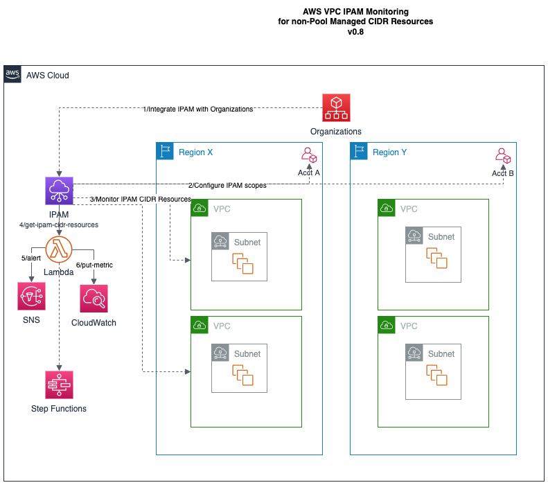

# aws-ipam-monitor-app

## :globe_with_meridians: Amazon IPAM Overview

[Amazon VPC IPAM](https://docs.aws.amazon.com/vpc/latest/ipam/what-it-is-ipam.html) is a VPC feature that makes it easier for you to plan, track, and monitor IP addresses for your AWS workloads. You can use IPAM's automated workflows to more efficiently manage IP addresses.

You can use IPAM to do the following:
- Organize IP address space into routing and security domains
- Monitor IP address space that's in use and monitor resources that are using space against business rules
- View the history of IP address assignments in your organization
- Automatically allocate CIDRs to VPCs using specific business rules
- Troubleshoot network connectivity issues
- Enable cross-region and cross-account sharing of your Bring Your Own IP (BYOIP) addresses

## Amazon VPC IPAM Automation Examples

These examples provide an introduction to Amazon VPC IPAM and demonstrate how to integrate it into Lambda, SNS, CloudWatch, and other AWS services.

* [VPC IPAM Monitor Solution](src/aws-ipam-monitor-lib.py) can be used to monitor IPAM CIDR resources, evaluate their IP usage, and then take downstream action if the usage exceeds a threshold.  While the core AWS VPC IPAM does have CloudWatch metrics and alarms for IPAM-managed pools of IP addresses, the IPAM does _NOT_ support this feature for non-IPAM managed address pools which is the case for many customers since IPAM is a relatively new service only released in December 2021. Customers regularly need to be proactive about IP address allocation and usage well before these limited resources are exhausted, so a natural approach is to setup SNS alerts or publish metrics based on IP address usage exceeding a user-defined threshold, and then take other downstream actions.  

This solution addresses these service gaps for users and customers who have existing VPC resources that are not managed through IPAM address pools.  The solution consists of a set of Python functions deployed as a Docker container attached to a Lambda Function and packaged through the AWS Serverless Application Model (SAM).  The solution can be run as-is as a standalone/scheduled Lambda function.  It also integrates with other AWS services such as publishing alerts to SNS topics, sending metrics to CloudWatch, and passing IPAM CIDR information as JSON to other Lambda functions as part of a larger composite workflow and observability system.



### Clone Git repo
git clone https://github.com/bishrtabbaa/aws-ipam-monitor-app

### Build Git repo
```
cd aws-ipam-monitor-app
sam build --use-container --container-env-var-file env.json

....

Build Succeeded
```

### Test Git repo locally 

Uses default AWS credentials located at ~/.aws/credentials
```
sam validate

....

sam local invoke --event events/event-lambda.json --env-vars env.json IpamMonitorFunction
```

### Deploy SAM app to AWS

Use deployment parameter values for the `region`, `IpamUsageThreshold`, and `IpamSnsTopic` that are appropriate for your environment and use case. It is likely that this solution will reside where you already setup IPAM for your AWS Organization in the management (parent) account.
```
sam deploy --guided --capabilities CAPABILITY_NAMED_IAM --debug

Setting default arguments for 'sam deploy'
=========================================
Stack Name [sam-app]: sam-ipam-monitor-app
        AWS Region [us-east-2]: 
        Parameter IpamUsageThreshold [80.0]: 
        Parameter IpamSnsTopic []: arn:aws:sns:us-east-2:645411899653:my-aws-training-sns-lambda
        Confirm changes before deploy [y/N]: y
        Allow SAM CLI IAM role creation [Y/n]: Y
        Disable rollback [y/N]: N

...

Waiting for changeset to be created..
CloudFormation stack changeset
--------------------------------------------------------------------------------------------------------------------
Operation   LogicalResourceId                              ResourceType                                 Replacement                                  
--------------------------------------------------------------------------------------------------------------------
+ Add IpamMonitorEventSchedulePermission             AWS::Lambda::Permission                        N/A                                          
+ Add IpamMonitorEventScheduleRule                   AWS::Events::Rule                              N/A                                          
+ Add IpamMonitorFunctionRole                        AWS::IAM::Role                                 N/A                                          
+ Add IpamMonitorFunction                            AWS::Lambda::Function                          N/A                                          
+ Add IpamMonitorLambdaExecutionRole                 AWS::IAM::Role                                 N/A                                          
+ Add IpamMonitorPolicy                              AWS::IAM::Policy                               N/A                                          
--------------------------------------------------------------------------------------------------------------------
Changeset created successfully. 
arn:aws:cloudformation:us-east-2:645411899653:changeSet/samcli-deploy1669736569/53cfb356-19ba-4af7-837b-cd7673d9f47e

Previewing CloudFormation changeset before deployment
======================================================
Deploy this changeset? [y/N]: y

...

---------------------------------------------------------------------------------------------------------------------
CloudFormation outputs from deployed stack
---------------------------------------------------------------------------------------------------------------------
Outputs                                                                                                                                                           ---------------------------------------------------------------------------------------------------------------------
Key                 IpamMonitorFunctionArn                                                                                                                
Description         IPAM Monitor Lambda Function ARN                                                                                                             
Value               arn:aws:lambda:us-east-2:645411899653:function:sam-ipam-monitor-app-IpamMonitorFunction-1dKP6LEmaw70                         

Key                 IpamMonitorFunctionIamRoleArn                                                                                                     
Description         Implicit IAM Role created for IPAM Monitor function                                                                                              
Value               arn:aws:iam::645411899653:role/IpamMonitorLambdaExecutionRole                                                                                
-----------------------------------------------------------------------------------------------------------------------
Successfully created/updated stack - sam-ipam-monitor-app in us-east-2
```

### Future Work

* Integrate IPAM Cloud Watch metrics with external 3rd parties
* Demonstrate value with Slack/Teams notifications.
* Expand IPAM metrics
