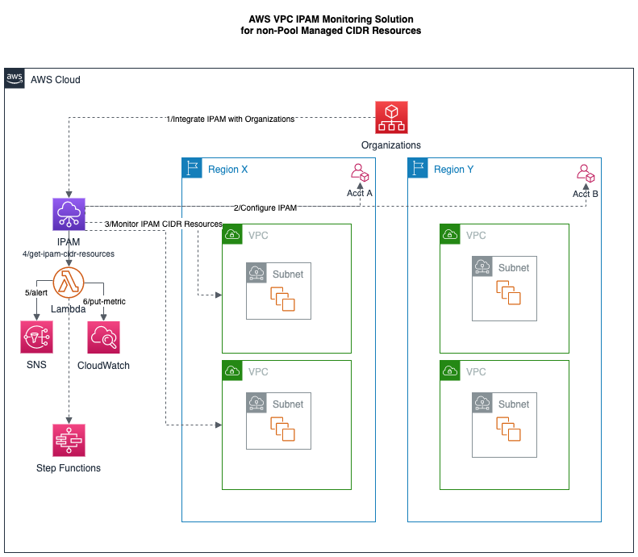

# aws-ipam-monitor-app

## :globe_with_meridians: Amazon IPAM Overview

[Amazon VPC IPAM](https://docs.aws.amazon.com/vpc/latest/ipam/what-it-is-ipam.html) is a VPC feature that makes it easier for you to plan, track, and monitor IP addresses for your AWS workloads. You can use IPAM's automated workflows to more efficiently manage IP addresses.

You can use IPAM to do the following:
- Organize IP address space into routing and security domains
- Monitor IP address space that's in use and monitor resources that are using space against business rules
- View the history of IP address assignments in your organization
- Automatically allocate CIDRs to VPCs using specific business rules
- Troubleshoot network connectivity issues
- Enable cross-region and cross-account sharing of your Bring Your Own IP (BYOIP) addresses

## Amazon VPC IPAM Automation Examples

These examples provide an introduction to Amazon VPC IPAM and demonstrate how to integrate it into Lambda, SNS, CloudWatch, and other AWS services.

- [VPC IPAM Monitor](aws-ipam-monitor-app.py) can be used to monitor IPAM CIDR resources, evaluate their IP usage, and then take downstream action if the usage exceeds a threshold.  While AWS VPC IPAM does have CloudWatch metrics for IPAM-managed pools of IP addresses, it does _NOT_ support this for non-IPAM managed address pools.  This solution addresses this service gap for users and customers.  The solution consists of a set of Python functions that can be run in CLI mode, referenced as part of a larger program or run as a standalone/scheduled Lambda function.  It also integrates with other AWS services such as publishing alerts to SNS topics, sending metrics to CloudWatch, or passing IPAM CIDR information as JSON to other Lambda functions as part of a larger StepFunction workflow.

